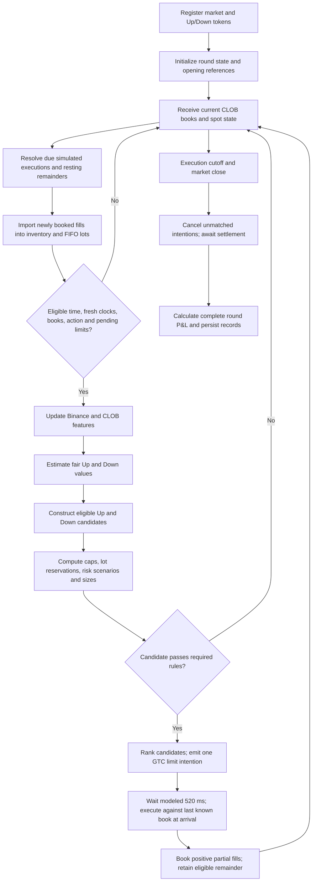

# Wallet3048: current implemented algorithm, workflow, and measured results

Reviewed: **September 10, 2026**. Strategy specification: **v5**.

Source commit: `2dda15dac6200d35d57e0cd86aa161b3cf049e02`.

This document describes the implementation in [wallet3048.js](engine/strategies/wallet3048.js), its simulation harnesses, and the September 7–9 research replays. It describes the current code, rather than claiming to recover the target wallet owner's private algorithm. The performance tables are historical **simulation estimates**, with the limitations described below.

Across the three Berlin-day replay samples, **453/860 first entries were correct
(52.67%)**, while **316/860 rounds were profitable (36.74%)**. Average winning
P&L was **+$51.11**, average losing P&L was **−$65.83**, and mean P&L was
**−$22.86 per scored round**. The combined net result was **−$19,658.90** under
the replay assumptions. Daily and hourly breakdowns appear in section 18.

## 1. What the strategy currently does

The bot trades BTC five-minute Up/Down markets by generating BUY-only GTC limit-order intentions. It combines short-term Binance momentum, confirmation from the Up token's midpoint, a heuristic settlement-value estimate, and inventory economics.

Its ordinary sequence is:

1. Wait for fresh inputs and agreement between Binance direction and CLOB midpoint movement.
2. Select a price-capped 50-share initial entry, or a 150-share entry when the edge/depth conditions permit.
3. After fills, consider directional reinforcement and purchases of the opposite outcome.
4. Prefer economically attractive pair completion when it is available; evaluate other complements as risk-reducing repairs.
5. Cancel unfilled remainders when their economics or directional support change, or when they time out.
6. Carry the resulting position to settlement and calculate its complete round P&L.

A separate cheap-token branch can buy a token offered at $0.01–$0.02 without normal directional confirmation or the ordinary expected-edge threshold. Its limit remains at or below $0.02, and it still passes the inventory-risk checks.

**The code does not require an arbitrage pair before entering. It also does not enforce a target such as “win $80, lose at most $60,” a minimum round reward/risk ratio, or average winning P&L greater than average losing P&L.** It evaluates individual candidates and projected positions, using fixed share templates and a share-imbalance constraint.

The implementation is hard-locked to simulation through [config.js](src/config/config.js) and the shadow harness. The strategy registry contains only wallet3048. Public wallet activity is separate from the strategy's market-data decision inputs; this is not a copier of the target wallet's contemporaneous orders.

## 2. Payoff and profitability: the quantities that matter

For the current autonomous BUY-only strategy, with no automatic merge or sale:

```text
U = total filled Up shares
D = total filled Down shares
C = total token acquisition cost, excluding fees
F = total execution fees

P&L if Up wins   = U - C - F
P&L if Down wins = D - C - F
Worst settlement P&L = min(U, D) - C - F
Share imbalance = U - D
```

A complete Up/Down pair contributes one unit of settlement payout under either outcome. The paired portion is `min(U,D)`; the residual directional position is `abs(U-D)`. That decomposition alone does not establish whether the position is profitable: acquisition costs and fees determine the result.

Illustrative arithmetic, not an observed trade: 200 Up shares and 60 Down shares acquired for $120 including fees produce **+$80 if Up wins and −$60 if Down wins**. The current bot does not explicitly solve for these target quantities or payoffs.

For many completed rounds:

```text
p = fraction of rounds with positive net P&L
W = average positive round P&L
L = absolute average negative round P&L

Mean P&L per round = p*W - (1-p)*L      [when every scored round is positive or negative]
Break-even profitable-round rate = L / (W + L)
Payoff ratio = W / L
Profit factor = total positive P&L / absolute total negative P&L
```

With breakeven rounds present, use separate positive and negative frequencies in the first formula. The measured cohorts below contain no zero-P&L scored rounds.

For the example `W=$80`, `L=$60`, the break-even rate is 42.86%; a 50% profitable-round rate gives +$10/round. **First-entry directional accuracy and profitable-round rate are separate measurements.** Buying the eventual winning side first does not guarantee that the final, hedged position earns money.

## 3. Runtime architecture and configuration

| Component | Responsibility |
|---|---|
| [src/index.js](src/index.js) | Starts feeds, maintains market lifecycle, passes current books and reference prices to the shadow engine |
| [wallet3048.js](engine/strategies/wallet3048.js) | Features, probability score, candidates, price caps, sizing, risk scenarios, cancellation rules |
| [shadow.js](src/execution/shadow.js) | Live-data simulation, delayed execution, partial-fill accounting, recording and settlement |
| [simrun.js](engine/simrun.js) | Historical replay using the same strategy step function |
| [fillsim.js](engine/fillsim.js) | Visible-depth execution, shared liquidity pools, reservations and maker-policy assumptions |
| [fees.js](engine/fees.js) | Implemented fee model and per-level execution fees |
| [resolution.js](src/execution/resolution.js) | Live settlement-reference requests and winner calculation |
| [history.js](src/sources/history.js) | Historical Bapi metadata and book normalization |
| [session.js](src/execution/session.js) | Session accounting and balance-based scaling of simulated fills |
| [db.js](src/sources/db.js) | Durable fills, session summaries and order-status events |

The code defaults come from `STRAT`. Live-shadow applies permitted saved/UI overrides and then any boot `SHADOW_PARAMS_JSON` settings. `LIVE_FILLS` remains false in the shadow harness. A saved snapshot with a mismatched specification version has its old `W3048_*` values and `LIMIT` filtered out before current defaults are used. Therefore, the old v3 snapshot in `data/fastmx-live/runtime-config.json` is not evidence that a new process would execute v3 rules.

The reviewed PM2 configuration names `poly-fastmx-simulation`, port 4520, database `poly_fastmx`, and runtime directory `data/fastmx-live`. The research runs used the root `data/runtime-config.json` merged over v5 defaults. Their saved parameter and source-code hashes match all three analyzed days. A per-window `cfg` snapshot is the appropriate evidence for the effective configuration of an actual recorded run.

### Timing: live events versus historical samples

**Live strategy evaluation is driven by native CLOB book callbacks.** The 120 ms UI interval is not the live strategy's sole decision clock. Binance and RTDS updates populate state; a CLOB callback supplies that current state to the strategy.

The research replays instead retain the last observation in each 120 ms Bapi book bucket. Both use the same strategy function, but different event cadence and timestamp provenance prevent a claim of exact live/replay equivalence.

## 4. Complete round workflow



At each evaluation the harness resolves already-due fills **before** asking for a new decision. The strategy therefore sees newly confirmed inventory when deciding whether to add exposure or hedge it. A decision is not booked as a fill merely because it was emitted.

The current `step()` emits at most one autonomous order per invocation. The window's action count increases on emitted intentions, including those that ultimately do not fill.

## 5. Round state and the simulated prepared order menu

Each round maintains:

- Filled Up/Down quantities, gross cost and fees.
- Unmatched FIFO lots for each side, with stable lot IDs and fee-inclusive cost per share.
- Binance price history, CLOB midpoint history and per-side depth traces.
- The start of the current unchanged best-ask run.
- Last emitted side, same-side last ask/time, action count and order sequence.
- Pending order quantities and reservations against specific opposite-side lots.

`preparedMenu` represents prices from $0.01 through $0.99 in $0.01 steps, with 50/150-share sizes, GTC order type, and `postOnly=false`. `W3048_PREPARE_LEAD_MS=90000` records a T−90-second preparation concept.

**In this simulation, the menu is an in-memory representation created by initialization. It is not evidence that private orders were signed and submitted 90 seconds before a round.** The strategy's real-fill/manual helper functions exist for integration compatibility; they do not enable autonomous real-money execution under the simulation lock.

## 6. Eligibility, freshness and throttling

The main checks in `step()` are:

| Check | Current rule |
|---|---|
| Strategy enabled | `W3048_ON=true` |
| Decision interval | `4 <= t < 298 - LATENCY_MS/1000` |
| With 520 ms latency | Last permissible decision is strictly before t+297.48s |
| Execution cutoff | No modeled arrival after t+298s |
| Binance source age | At most 1,000 ms |
| Chainlink/RTDS source age | At most 90,000 ms |
| Each outcome depth source age | At most 1,000 ms |
| Missing source clocks | Rejected by default |
| Future source timestamp | More than 1 ms into the future is treated as invalid/stale |
| Valid market inputs | Both outcome books need usable bid/ask values; Binance price and opening Binance reference must be positive |
| Global cooldown | At least 250 ms between emitted actions |
| Pending orders | Reject new actions when pending count is at least 2 |
| Action count | At most 120 emitted intentions per round |
| Same-side repeat | If the last emitted action was on this same side, suppress retries within 750 ms unless the ask has moved by at least $0.01 |

Feature and release histories update on eligible observations before the cooldown/pending checks, so those short pauses do not freeze the signals. Earlier failures, such as missing timestamps, do prevent those updates.

Starting eligibility at t+4s does not guarantee a normal entry at t+4s: the three-second CLOB confirmation also needs historical observations. The cheap-token exception does not need that directional confirmation.

Historical replay additionally skips a new decision on the first observation following a recorded gap longer than 6 seconds. This does not reconstruct the missing observations.

## 7. Book features and direction

### 7.1 Book quantities

For each outcome, `bookSnapshot()` calculates:

```text
midpoint = (best bid + best ask) / 2
microprice = (best-bid size * best ask + best-ask size * best bid)
             / (best-bid size + best-ask size)
depth imbalance = (sum of top-3 bid sizes - sum of top-3 ask sizes)
                  / (sum of top-3 bid sizes + sum of top-3 ask sizes)
```

With no positive top-level size sum, microprice falls back to midpoint. It also records depth at the best price, top-three depth sums, spread, and microprice minus midpoint. L2 availability is recognized from `depthKnown=true` or at least three ask and three bid levels.

Two different CLOB measures have different jobs:

1. **Direction confirmation:** change in the Up token's own bid/ask midpoint.
2. **Probability model input:** normalized microprice `UpMicro / (UpMicro + DownMicro)`, clamped to 0.01–0.99.

### 7.2 Binance fast direction

The engine retains timestamped Binance observations without inventing an observation on every unrelated CLOB update.

```text
momentumFast = ln(current Binance / last Binance observed at or before sourceTime - 500ms)
latestUpdate = ln(current Binance / most recent earlier distinctly different Binance price)
```

The latter is usable only when that distinct-price observation is within 750 ms. Missing/stale prerequisites produce zero for the corresponding feature.

`momentumSignal` uses nonzero `momentumFast`, otherwise `latestUpdate`. A positive signal selects Up and a negative signal selects Down. The configured minimum magnitude is zero, but an actual nonzero signal is still required. The legacy diagnostic field named `momentum5s` now contains the **500 ms** feature.

### 7.3 CLOB confirmation

```text
clobVelocity = current Up midpoint
               - last Up midpoint observed at or before evaluationTime - 3000ms
```

- Up confirmation: delta at least +$0.02.
- Down confirmation: delta at most −$0.02.
- Otherwise: no confirmed CLOB direction.

This is a token-price change, not a 2% BTC return and not a velocity divided by elapsed seconds. Ordinary first-entry direction is allowed only when this confirmation agrees with the fast Binance direction. The optional flat-both-sides ablation is off in the measured configuration.

Once inventory exists, a complement can be considered without fresh same-side directional alignment; it must still pass its applicable economic, risk and release conditions. A non-complement reinforcement normally requires alignment. Cheap-token candidates have their own exception.

## 8. Heuristic fair-value calculation

Additional features are:

```text
Binance displacement   = ln(current Binance / opening Binance)
Chainlink displacement = ln(current Chainlink / opening Chainlink), or 0 if unavailable
relativeLead           = Binance displacement - Chainlink displacement
clobDepthSignal        = clamp((Up imbalance - Down imbalance)/2, -1, 1)
timeProgress           = clamp(t / 298, 0, 1)
```

Volatility is the square root of summed squared log returns on a one-second as-of sampling grid over a 30-second lookback. It is computed and logged, but its coefficient is zero in the current score.

Define `z(x,s)=clamp(x/s,-4,4)`. The default score is:

```text
score = logit(normalized Up microprice)
      + 0.40 * z(momentumFast,          0.00010)
      + 0.05 * z(latestUpdate,          0.00005)
      + 0.05 * z(relativeLead,          0.00050)
      + 0.10 * z(Chainlink displacement,0.00100)
      + 0.20 * clobDepthSignal
      + 0.20 * timeProgress * z(Chainlink displacement, 0.00100)

fairUp   = clamp(sigmoid(score), 0.01, 0.99)
fairDown = 1 - fairUp
```

The intercept is zero and the market-logit coefficient is one. These coefficients were assigned heuristically: the implementation explicitly marks them as **not fitted to settlement outcomes and not statistically calibrated**. `fairUp=0.60` is therefore a model score interpreted as probability, not established evidence of a 60% win frequency.

## 9. Order-book release features

The release subsystem follows each side's ask stability and one-second changes in bid, ask and top-three ask depth. It retains approximately 31 seconds of book trace.

It recognizes three modes:

| Mode | Conditions |
|---|---|
| Thin/depleting L2 | Same ask for at least 525 ms; best-ask depth <=100 shares; top-three ask depth <=410; top-three ask depth decreased by at least 110 shares versus the one-second reference |
| L2 pressure | Top-three ask depth <=800; depth imbalance >=0.20; top-three ask depth decreased by at least 300 shares |
| BBA-only pressure fallback | No L2 classification; same ask for at least 525 ms; ask fell at least $0.01 or bid rose at least $0.01 over the reference interval |

With L2, the liquidity score is:

```text
(410 - askDepth3)/410
+ 2*depthImbalance
- oneSecondAskDepthChange/300
+ micropriceBias/max(0.01, spread)
```

Without L2, it uses `(-askMove1 + bidMove1)/0.01`. Candidate ranking clips the result to −2…+2.

**The release gate is not a universal prerequisite.** The code rejects a candidate for failing release only when it is marketable, not direction-aligned, and not a cheap-token candidate. An aligned ordinary entry can pass without the thin/depletion pattern. A below-ask intention can also be evaluated without passing it. A BBA signal does not itself create executable depth: the execution simulator does not invent infinite liquidity from a quote.

The diagnostic `releaseMode="disabled"` can mean that none of the named patterns matched; it should not by itself be read as proof that the release-gate parameter was off.

## 10. FIFO matching, reservations and complements

Confirmed fills create cost-bearing lots. Fee-inclusive lot cost comes from the recorded execution quantities, level costs and fees, rather than an assumed order limit. Partial fills are imported incrementally.

A candidate is a complement when it buys against the current confirmed net share imbalance. Its requested match is at most the smaller of its size and that imbalance. The engine then:

1. Reserves eligible unmatched lots on the opposite side.
2. Subtracts reservations already held by other pending orders on this candidate's side.
3. Preserves preferred lot IDs when re-evaluating a resting remainder.
4. Divides the candidate into `matchedShares` and `directionalShares`.

This prevents two pending hedges from both claiming the same existing shares as their profitable pair opportunity. Pending, unfilled opposite orders do not become confirmed matching inventory.

On execution, actual fill quantities consume reservation slices and the corresponding unmatched lots. Any excess creates new lots on the acquired side. Matching removes lots from the **unmatched-lot lists**; it does not sell tokens or remove filled shares from the aggregate holdings.

The strategy itself emits no automatic merge or sell orders. Shared harnesses contain merge/legacy sell accounting, but those facilities are not an autonomous exit rule in this version.

## 11. Price caps and expected acquisition cost

For a candidate with side probability `fair`, define progress for inventory/economic schedules:

```text
g = clamp((t - 4) / (298 - 4), 0, 1)
leanLimit = 500 - 150*g
orientedInventory = (U - D) * (+1 for Up, -1 for Down)
inventoryPenalty = 0.04 * clamp(orientedInventory / leanLimit, 0, 1)
                   when orientedInventory > 0; otherwise 0
```

### 11.1 Directional cap

```text
signalCapMaker = fair - 0.005 - inventoryPenalty
signalCapTaker = signalCapMaker - modeled taker fee per share at the current ask
```

Thus adding to an existing lean lowers the acceptable price. The later utility formula also subtracts the inventory penalty explicitly; both appearances are part of the implementation.

### 11.2 Profitable-pair cap

For a reserved opposite lot with fee-inclusive average cost `oppositeCost`:

```text
pairCapMaker = 1 - oppositeCost - 0.06
pairCapTaker = pairCapMaker - modeled taker fee per share at the current ask
```

`pairingIntended` requires positive matched shares and current ask <= `pairCapMaker`. In this branch, the price cap must satisfy both the signal and pair caps. The $0.06 parameter is a **per-matched-pair acquisition target**, not $0.06 profit on every share or a guaranteed whole-round return.

If the ask is above that pair-cap condition, the candidate enters the separate repair branch. It is not labeled profitable pair completion simply because it buys the opposite outcome.

### 11.3 Limit construction and role

For ordinary candidates, the engine first checks whether the taker economic cap can reach the best ask. It then floors the final cap to the $0.01 grid, respecting:

- Configured maximum price and `LIMIT`, both $0.99 here.
- The applicable economic cap.
- For a crossing attempt: at most current ask +$0.01.
- For a below-ask intention: at most current ask −$0.01.

For the cheap-token branch, a hard acquisition cap of $0.02 replaces the normal economic-cap selection. It can never authorize a walk above $0.02.

The candidate walks the visible ask ladder under its cap. It records immediate quantity/VWAP, immediate level fees, and the remaining unfilled quantity. Its decision-time estimate is:

```text
projectedCost = visible immediate cost + remaining shares * limit cap
expectedPx   = projectedCost / requested size
feePerShare  = projected immediate taker fees / requested size
expectedEdge = fair - expectedPx - feePerShare
```

The estimated remaining portion is priced at the cap with maker fees of zero. **That is a candidate valuation assumption, not a promise of a later fill.** Under strict-no-maker, that resting quantity contributes no execution unless it was already matched at initial arrival.

## 12. Risk scenarios and economic acceptance

### 12.1 Independent pending-order outcomes

For `n` outstanding orders the risk evaluator enumerates `2^n` full-fill/no-fill combinations. It evaluates the position before and after adding the full proposed candidate in each combination. Pending arrivals are valued at their limit plus modeled taker fees; resting remainders use limit and maker fee assumptions.

The hard acceptance rule is:

```text
Every scenario must satisfy:
    projected absolute share imbalance <= current leanLimit
OR:
    the scenario already violates leanLimit
    AND the proposed order does not increase that imbalance
```

The code also calculates projected worst settlement P&L and spending for diagnostics and candidate scoring. **Those dollar metrics are not hard loss or spend ceilings in v5.** In particular, `boundedRepair` in this function constrains share imbalance; the name does not mean a separate guaranteed dollar-loss bound.

There is no implemented cumulative session-loss breaker, per-round dollar stop, or per-round gross-spending maximum in these strategy rules. Balanced buying can add substantial acquisition cost without increasing the net share imbalance.

### 12.2 Required edge

The base minimum edge rises from 0.0025 to 0.0100 over the active interval. Nonmarketable candidates receive a 0.0025 discount, floored at zero.

| Candidate | Additional acceptance logic |
|---|---|
| First ordinary entry | Expected edge must meet the base minimum |
| Non-complement reinforcement | Expected edge must meet the base minimum +0.015; normally requires current direction alignment |
| Intended pair completion | Pair edge must meet the base minimum; any residual directional shares must independently meet their directional minimum |
| Other complement/repair | Risk-adjusted edge must meet the base minimum +0.020; any directional excess must pass its own minimum |
| Cheap token | Bypasses the ordinary economic-pass test, but still passes cap validity and risk checks |

A complement's directional excess is checked against the base `minEdge` in
this implementation. The extra 0.015 reinforcement threshold applies only
when the candidate itself is not a complement.

Definitions:

```text
pairEdge = 1 - oppositeCost - expectedPx - feePerShare
worstCaseImprovement = minimum post-candidate scenario P&L
                       - minimum pre-candidate scenario P&L
riskReliefPerShare = max(0, worstCaseImprovement / size)
riskWeight = interpolate(0.05, 0.70, g)
riskAdjustedEdge = expectedEdge + riskWeight*riskReliefPerShare
```

These are heuristic candidate acceptance and scoring rules. A repair designation does not ensure a winning final round, and increasing risk-relief weight does not enforce a minimum average-win/average-loss ratio.

## 13. Share sizing and candidate ranking

### 13.1 Active fixed sizing

The bot evaluates **50 shares first**. If that candidate fails, it does not independently search for an admissible 150-share candidate.

After a valid 50-share candidate, it considers 150 shares when:

```text
max(expectedEdge, finite pairEdge) >= 0.035
AND relevant depth capacity >= 100 shares
```

Depth capacity means ask quantity executable under the limit for a marketable candidate, or top-three bid depth for a below-ask candidate. The 150-share alternative is fully re-evaluated for economics and risk; if it fails, the 50-share candidate remains. Risk relief alone does not authorize tripling the order size.

Cheap-token candidates remain at 50 shares in the active fixed-size configuration. Actual fills can be smaller than the requested parent due to limited depth or price movement during latency.

### 13.2 Optional incremental mode

The implemented but inactive `incremental` mode evaluates sizes from 5 to 150 in increments of 5, selecting the largest total utility rather than simply the highest utility per share. This is not the size policy used in the reported results. In that alternative branch, the fixed-mode early return that keeps cheap-token parents at 50 does not apply.

### 13.3 Utility and final choice

For intended pairing, directional expected P&L applies only to unmatched residual shares, and pair expected P&L applies only to matched shares. This avoids attributing both kinds of edge to the same matched quantity.

```text
directionalExpectedPnl = expectedEdge * (directionalShares if pairingIntended else size)
pairExpectedPnl = pairEdge * matchedShares, only if pairingIntended
pairWeight = interpolate(0.35, 1.25, g)

utility = directionalExpectedPnl / size
        - inventoryPenalty
        + pairWeight * max(0, pairExpectedPnl) / size
        + riskWeight * riskReliefPerShare
        + 0.015 * clamp(liquidityScore, -2, 2)
```

Candidates are sorted by:

1. Cheap-token status first.
2. Higher utility.
3. Higher expected edge.
4. Lower limit cap.
5. Side name as a deterministic final tie-breaker.

The selected ordinary candidate needs positive utility. A cheap-token candidate bypasses that final positive-utility requirement. Thus cheap-token acquisition is a substantive policy exception, not merely a smaller version of the ordinary signal trade.

## 14. Order reasons and what they mean

| Recorded reason | Meaning |
|---|---|
| `w3048-initial-release` | First ordinary intention while the confirmed position has no shares |
| `w3048-directional-reinforcement` | Adds on a side that is not a complement of the confirmed imbalance |
| `w3048-pair-completion` | Complement satisfying the intended pairing condition |
| `w3048-loss-cap-repair` | Complement handled by the separate repair economics |
| `w3048-cheap-token` | Token offered at or below the configured cheap-token threshold |

The order's `leg` is `hedge` for a complement and `entry` otherwise. All autonomous orders are GTC limits with `postOnly=false`. Therefore, “limit order” does not mean “maker-only.” An intention may cross immediately or rest below the ask.

The intention initially contains some legacy labels such as `exec="marketable"`; its `signal.expectedRole` describes the candidate's evaluated role. The actual fill record receives execution-specific maker/taker fields. Use fill evidence rather than the generic intention label when classifying executions.

## 15. Execution, cancellation and inventory updates

### 15.1 Arrival and partial fills

The harness schedules arrival at decision time +520 ms. It uses the latest recorded book available **at or before** that arrival time, respects the limit, and consumes actual visible ask quantities. It does not use a later book to pretend liquidity existed earlier.

A shared liquidity pool is keyed by outcome and depth-event identity. Two simulated orders or lifecycle phases cannot independently consume the same snapshot's entire ask quantity. A new external event identity creates a new pool.

Each positive fill receives a separate fill ID and immutable decision provenance. Cost, fee, levels, timing and inventory are booked immediately, including partial fills. Any share remainder becomes resting GTC inventory intention, rather than a filled position.

### 15.2 Maker policies

| Policy | Resting fill treatment |
|---|---|
| **`strict-no-maker` — active** | No resting fills; only positive initial-arrival matches contribute shares |
| `book-cross-inference` | Infers a maker fill from a sufficiently crossed later book; explicitly unverified |
| `observed-flow-estimate` | Adds eligible identified sell-flow evidence under an explicit queue assumption; also permits book-cross inference |
| `optimistic-touch` | Adds time-at-price touch estimates; also permits book-cross inference |

Legacy `W3048_MAKER_FILL_ASSUMPTION="zero"` maps to book-cross inference if it is used without an explicit modern policy. The analyzed configuration explicitly sets `strict-no-maker`, so the legacy string does not enable that inference.

### 15.3 Cancellation and replacement

The unfilled remainder expires after 10,000 ms from arrival or at the t+298s cutoff, whichever comes first. On eligible book events, the harness may cancel earlier when:

- An ordinary initial/reinforcement order's fast direction reverses with magnitude at least 0.00002.
- Its confirmed CLOB direction reverses under the enabled midpoint gate.
- The new economic cap falls below the existing limit. Cap slack is zero ticks.
- The current cap is invalid or below the minimum price.

Revaluation excludes the order itself from competing reservation consumption and preserves its preferred reserved lots. Direction-reversal cancellation is keyed to the two ordinary directional reason codes; it is not applied identically to pair, repair and cheap-token reasons. Those still undergo cap/timeout checks.

If books/features are unavailable, `shouldCancelResting()` returns a no-book/no-features result rather than automatically treating that observation as an economic cancellation; effective timeout/cutoff still applies. The harness also avoids reprocessing the same depth event. A cancellation does not automatically issue a replacement: a later `step()` must choose a new candidate under the normal rules.

Canceling a remainder does **not** undo already filled shares. The current autonomous policy reduces exposure by buying the opposite side, not by selling held shares through a stop-loss order.

### 15.4 Implemented fee accounting

The code's default taker fee is:

```text
fee(price, shares) = round_to_5_decimals(0.07 * price * (1-price) * shares)
```

Amounts below 0.00001 are suppressed. Execution fees are calculated per consumed price level and summed; maker fills have zero modeled fee. These statements describe [the implemented model](engine/fees.js), not an independent verification of every market's current venue fee schedule. The replay totals include modeled fees and do not credit maker rebates.

## 16. Closing, settlement, recording and recovery

At cutoff/close, unmatched intentions are canceled; end-of-file or rollover is not evidence of a fill. The window is recorded as pending until a final winner is available.

The live resolution implementation requests the Polymarket crypto-price endpoint with a 60-second TWAP selection, waits for `completed`, and compares valid opening/closing reference values. Exact equality defaults to Up in the code's tie setting. Opening reference requests have a default ten-second delay; early RTDS boundary values are provisional. These are the implementation's requests and conventions, not a claim that Bapi and the live venue always supply identical data.

The research studies use Bapi's `winSide` instead. That distinction matters when auditing disagreements or delayed metadata.

Settlement calculates the full position P&L, persists a session summary, emits the resolved event, and releases high-frequency buffers. When recording is enabled, schema-2 payloads can include config, opening references, decisions, fills, per-event books and clocks, with separate instrumentation records and manifest-directed paths.

MongoDB collections separate modeled and real execution records, including `shadow_fills_sim`, `shadow_sessions_sim` and `order_status_sim`. Fill identities make persistence idempotent. Restart hydration restores durable fills and decision/action counters, then warms momentum histories again from fresh observations. It does not fabricate the missing pre-restart signal history.

There are two distinct capital treatments:

- The hourly studies replay each round independently at the specified share sizes, without a session bankroll constraint.
- The session backtest wrapper can proportionally scale an already-generated round's fill ledger to available balance, based on peak deployment. It does not rerun all candidate decisions at the scaled quantities.

Consequently, the daily study totals below are not a funded-account return curve or a claim that a particular starting bankroll could execute every modeled fill.

## 17. Condensed algorithm pseudocode

```text
on current-market CLOB book event:
    read current Up/Down depth, Binance and RTDS state
    resolve previously due arrivals and eligible resting remainders
    book each positive partial fill with its own cost and fee

    initialize/synchronize strategy state and unmatched FIFO lots
    reject if outside decision interval, stale/missing clocks,
              missing books/references, or action limit reached
    update market features and release traces
    reject if cooldown or pending-order cap applies

    calculate heuristic fairUp and fairDown
    determine fast Binance direction and confirmed CLOB direction
    identify any <=$0.02 cheap-token side

    for each eligible side:
        apply same-side retry suppression
        evaluate 50-share candidate:
            reserve confirmed opposite FIFO lots
            calculate signal/pair/acquisition caps and floor limit to tick
            estimate visible execution, resting remainder and fees
            enumerate independent pending-order risk scenarios
            reject invalid cap or excessive projected share imbalance
            evaluate ordinary, pair or repair edge conditions
            apply cheap-token exceptions where specified
            calculate utility
        possibly re-evaluate at 150 shares under edge/depth conditions

    rank surviving candidates; require positive utility unless cheap-token
    emit one GTC intention and update action/retry state
    schedule modeled arrival; do not book it as inventory yet

at modeled arrival:
    consume available depth at/before arrival, within the signed cap
    book actual matched quantities
    retain unmatched GTC remainder under timeout/cancellation rules

at cutoff/close:
    discard unmatched intentions
    await winner
    calculate winning shares - acquisition cost - fees
    persist the complete round ledger
```

## 18. Measured entry accuracy and round economics

The following tables use **Berlin calendar days, UTC+02:00**, for September 7–9, 2026. Parameters and source hashes match across the three analyses and the reviewed implementation.

Definitions:

- **Initial-entry accuracy:** first positive-share simulated fill's outcome equals Bapi's final winner; one observation per scored round.
- **Profitable-round rate:** complete round P&L is positive, after modeled fees.
- **Average winning round:** mean net P&L among profitable rounds only.
- **Average losing round:** signed mean net P&L among losing rounds only.
- **Mean P&L/round:** net P&L divided by included rounds; it is not the average winner.

These are current-strategy replays, a different population from the earlier target-wallet actual-first-buy study beginning August 22.

### 18.1 Entry direction versus profitable rounds

| Berlin date | Scored / expected | Correct first entry | Entry accuracy | Profitable rounds | Losing rounds | Profitable-round rate |
|---|---:|---:|---:|---:|---:|---:|
| September 7 | 288/288 | 148 | 51.39% | 96 | 192 | 33.33% |
| September 8 | 288/288 | 154 | 53.47% | 113 | 175 | 39.24% |
| September 9 | 284/288 | 151 | 53.17% | 107 | 177 | 37.68% |
| Combined | 860/864 | 453 | 52.67% | 316 | 544 | 36.74% |

### 18.2 Profit and loss per round

| Berlin date | Average winning round | Average losing round | Mean P&L per scored round | Total net P&L |
|---|---:|---:|---:|---:|
| September 7 | +$43.86 | −$52.84 | −$20.61 | −$5,934.71 |
| September 8 | +$54.94 | −$67.81 | −$19.65 | −$5,658.71 |
| September 9 | +$53.57 | −$77.95 | −$28.40 | −$8,065.48 |
| Combined | +$51.11 | −$65.83 | −$22.86 | −$19,658.90 |

### 18.3 Does the measured payoff ratio meet the desired condition?

| Berlin date | Average win / average loss magnitude | Profit factor | Observed profitable-round rate | Break-even rate at observed average win/loss |
|---|---:|---:|---:|---:|
| September 7 | 0.830 | 0.415 | 33.33% | 54.64% |
| September 8 | 0.810 | 0.523 | 39.24% | 55.24% |
| September 9 | 0.687 | 0.415 | 37.68% | 59.27% |
| Combined | 0.776 | 0.451 | 36.74% | 56.29% |

Every measured daily payoff ratio is below 1, and the observed profitable-round rate is below the corresponding break-even rate. These calculations describe the sample; the break-even rates are not forecasts of achievable performance. Combined figures are calculated from all included rounds, not by averaging daily averages.

### 18.4 A correct first entry can still lose money

| Berlin date | Correct first entry, profitable round | Correct first entry, losing round | Wrong first entry, profitable round | Wrong first entry, losing round |
|---|---:|---:|---:|---:|
| September 7 | 66 | 82 | 30 | 110 |
| September 8 | 90 | 64 | 23 | 111 |
| September 9 | 89 | 62 | 18 | 115 |
| Combined | 245 | 208 | 71 | 336 |

For example, on September 9, 62 of the 151 rounds with a correct first entry still ended at a net loss. The opposite outcome also occurs: later position construction can make money after an initially wrong side. This is why the round-level ledger must be evaluated separately from first-entry accuracy.

### 18.5 Hourly accuracy, average winners and average losers

Each hour is assigned by market start in Berlin time. `Positive / negative` counts refer to complete-round P&L. Dollar averages condition on their respective positive or negative groups. A dash means that the group has no observations. Each hourly group has at most 12 rounds.

#### September 7, 2026

| Hour | Correct / scored | Entry accuracy | Positive / negative rounds | Average win | Average loss | Net P&L |
|---|---:|---:|---:|---:|---:|---:|
| 00:00 | 9/12 | 75.00% | 4/8 | +$41.02 | −$38.57 | −$144.45 |
| 01:00 | 8/12 | 66.67% | 5/7 | +$101.62 | −$89.71 | −$119.89 |
| 02:00 | 4/12 | 33.33% | 3/9 | +$76.14 | −$99.34 | −$665.66 |
| 03:00 | 5/12 | 41.67% | 5/7 | +$102.39 | −$91.19 | −$126.38 |
| 04:00 | 8/12 | 66.67% | 6/6 | +$44.69 | −$65.57 | −$125.29 |
| 05:00 | 6/12 | 50.00% | 5/7 | +$34.22 | −$84.43 | −$419.94 |
| 06:00 | 5/12 | 41.67% | 2/10 | +$18.85 | −$59.78 | −$560.11 |
| 07:00 | 9/12 | 75.00% | 4/8 | +$30.55 | −$48.16 | −$263.08 |
| 08:00 | 5/12 | 41.67% | 4/8 | +$18.42 | −$30.60 | −$171.12 |
| 09:00 | 8/12 | 66.67% | 2/10 | +$102.22 | −$75.28 | −$548.38 |
| 10:00 | 6/12 | 50.00% | 4/8 | +$43.23 | −$31.56 | −$79.51 |
| 11:00 | 6/12 | 50.00% | 4/8 | +$18.56 | −$32.60 | −$186.54 |
| 12:00 | 7/12 | 58.33% | 4/8 | +$68.69 | −$20.66 | +$109.46 |
| 13:00 | 4/12 | 33.33% | 6/6 | +$40.40 | −$36.60 | +$22.81 |
| 14:00 | 4/12 | 33.33% | 4/8 | +$33.25 | −$23.98 | −$58.79 |
| 15:00 | 3/12 | 25.00% | 5/7 | +$26.45 | −$23.96 | −$35.48 |
| 16:00 | 4/12 | 33.33% | 1/11 | +$46.55 | −$80.40 | −$837.88 |
| 17:00 | 4/12 | 33.33% | 3/9 | +$14.53 | −$89.62 | −$762.99 |
| 18:00 | 6/12 | 50.00% | 4/8 | +$20.83 | −$40.58 | −$241.33 |
| 19:00 | 11/12 | 91.67% | 6/6 | +$12.39 | −$47.16 | −$208.65 |
| 20:00 | 7/12 | 58.33% | 4/8 | +$42.72 | −$26.36 | −$40.01 |
| 21:00 | 5/12 | 41.67% | 3/9 | +$3.65 | −$37.24 | −$324.22 |
| 22:00 | 8/12 | 66.67% | 5/7 | +$47.74 | −$28.12 | +$41.83 |
| 23:00 | 6/12 | 50.00% | 3/9 | +$74.34 | −$45.79 | −$189.10 |

#### September 8, 2026

| Hour | Correct / scored | Entry accuracy | Positive / negative rounds | Average win | Average loss | Net P&L |
|---|---:|---:|---:|---:|---:|---:|
| 00:00 | 6/12 | 50.00% | 4/8 | +$46.78 | −$78.17 | −$438.22 |
| 01:00 | 7/12 | 58.33% | 3/9 | +$55.28 | −$67.19 | −$438.88 |
| 02:00 | 4/12 | 33.33% | 5/7 | +$27.84 | −$63.89 | −$308.00 |
| 03:00 | 1/12 | 8.33% | 0/12 | — | −$37.73 | −$452.82 |
| 04:00 | 5/12 | 41.67% | 6/6 | +$21.57 | −$46.56 | −$149.92 |
| 05:00 | 6/12 | 50.00% | 8/4 | +$34.97 | −$130.30 | −$241.41 |
| 06:00 | 6/12 | 50.00% | 4/8 | +$27.96 | −$66.17 | −$417.55 |
| 07:00 | 6/12 | 50.00% | 4/8 | +$51.28 | −$68.40 | −$342.07 |
| 08:00 | 7/12 | 58.33% | 6/6 | +$72.08 | −$95.79 | −$142.30 |
| 09:00 | 8/12 | 66.67% | 3/9 | +$44.31 | −$66.17 | −$462.61 |
| 10:00 | 6/12 | 50.00% | 5/7 | +$82.71 | −$84.26 | −$176.23 |
| 11:00 | 3/12 | 25.00% | 3/9 | +$35.90 | −$58.04 | −$414.63 |
| 12:00 | 5/12 | 41.67% | 6/6 | +$31.79 | −$54.19 | −$134.40 |
| 13:00 | 6/12 | 50.00% | 7/5 | +$34.87 | −$39.26 | +$47.80 |
| 14:00 | 9/12 | 75.00% | 4/8 | +$64.41 | −$66.74 | −$276.30 |
| 15:00 | 8/12 | 66.67% | 6/6 | +$99.89 | −$78.52 | +$128.18 |
| 16:00 | 5/12 | 41.67% | 6/6 | +$73.17 | −$127.63 | −$326.75 |
| 17:00 | 9/12 | 75.00% | 5/7 | +$90.06 | −$50.55 | +$96.50 |
| 18:00 | 9/12 | 75.00% | 6/6 | +$71.97 | −$34.30 | +$226.03 |
| 19:00 | 11/12 | 91.67% | 7/5 | +$63.07 | −$89.63 | −$6.65 |
| 20:00 | 8/12 | 66.67% | 3/9 | +$99.95 | −$74.76 | −$372.97 |
| 21:00 | 5/12 | 41.67% | 1/11 | +$48.36 | −$90.94 | −$952.00 |
| 22:00 | 6/12 | 50.00% | 7/5 | +$29.66 | −$63.59 | −$110.31 |
| 23:00 | 8/12 | 66.67% | 4/8 | +$73.21 | −$35.76 | +$6.79 |

#### September 9, 2026

| Hour | Correct / scored | Entry accuracy | Positive / negative rounds | Average win | Average loss | Net P&L |
|---|---:|---:|---:|---:|---:|---:|
| 00:00 | 6/12 | 50.00% | 4/8 | +$39.94 | −$71.67 | −$413.64 |
| 01:00 | 6/12 | 50.00% | 1/11 | +$0.43 | −$60.76 | −$667.94 |
| 02:00 | 7/12 | 58.33% | 6/6 | +$26.16 | −$50.91 | −$148.48 |
| 03:00 | 6/12 | 50.00% | 3/9 | +$89.68 | −$101.35 | −$643.14 |
| 04:00 | 9/12 | 75.00% | 3/9 | +$59.65 | −$60.64 | −$366.83 |
| 05:00 | 4/12 | 33.33% | 4/8 | +$28.51 | −$51.56 | −$298.46 |
| 06:00 | 5/12 | 41.67% | 3/9 | +$48.53 | −$48.45 | −$290.51 |
| 07:00 | 9/12 | 75.00% | 7/5 | +$44.56 | −$64.91 | −$12.61 |
| 08:00 | 6/12 | 50.00% | 5/7 | +$18.93 | −$109.53 | −$672.10 |
| 09:00 | 11/12 | 91.67% | 7/5 | +$29.90 | −$12.50 | +$146.77 |
| 10:00 | 2/12 | 16.67% | 3/9 | +$63.32 | −$139.02 | −$1,061.23 |
| 11:00 | 7/12 | 58.33% | 7/5 | +$41.71 | −$86.09 | −$138.48 |
| 12:00 | 8/12 | 66.67% | 6/6 | +$49.18 | −$107.35 | −$349.01 |
| 13:00 | 6/11 | 54.55% | 6/5 | +$80.92 | −$34.29 | +$314.06 |
| 14:00 | 5/11 | 45.45% | 5/6 | +$45.13 | −$123.46 | −$515.11 |
| 15:00 | 8/12 | 66.67% | 7/5 | +$69.27 | −$82.35 | +$73.18 |
| 16:00 | 4/12 | 33.33% | 4/8 | +$112.68 | −$157.24 | −$807.23 |
| 17:00 | 7/12 | 58.33% | 3/9 | +$72.65 | −$118.73 | −$850.66 |
| 18:00 | 6/10 | 60.00% | 7/3 | +$92.38 | −$117.30 | +$294.76 |
| 19:00 | 5/12 | 41.67% | 2/10 | +$90.91 | −$27.62 | −$94.40 |
| 20:00 | 4/12 | 33.33% | 2/10 | +$22.38 | −$51.84 | −$473.62 |
| 21:00 | 5/12 | 41.67% | 2/10 | +$37.19 | −$65.35 | −$579.16 |
| 22:00 | 8/12 | 66.67% | 5/7 | +$83.05 | −$90.95 | −$221.40 |
| 23:00 | 7/12 | 58.33% | 5/7 | +$17.30 | −$53.83 | −$290.26 |

## 19. Evidence limitations and what is not established

1. **Historical timestamp mapping:** the production Bapi adapter drops Binance/Chainlink source timestamps needed by the current strategy. Unmodified adapter replay produced zero fills, making its first-entry accuracy undefined. The research adapter explicitly maps Bapi `binanceAggMinRecvTsMs`/`binanceMinRecvTsMs`, `spotMinRecvTsMs` and `clobMinRecvTsMs` into freshness clocks. These are recorder receive clocks, not the original live exchange payload clocks.
2. **Cadence and depth:** the studies use 120 ms last-observation samples and three levels per book side. Native live CLOB callbacks can produce a different decision/cancel sequence.
3. **Execution:** 520 ms is modeled latency. Visible-depth arrival execution is simulated, not confirmed wallet execution. Resting maker fills are disabled; other maker policies are explicitly unverified alternatives.
4. **Candidate/execution mismatch:** candidate utility can value a full parent's resting remainder, while strict-no-maker realizes only its initial-arrival matches. Projected paired proportions and actual filled proportions can differ.
5. **September 9 exclusions:** four rounds fail the pre-existing start/end coverage rule: 13:55, 14:00, 18:05 and 18:10 Berlin. A qualifying file must start within two seconds of opening and extend to within two seconds of closing. This reduces that day's denominator to 284.
6. **September 7 interior gap:** the 14:30 round contains a 28.094-second book gap from t+168.461 to t+196.555. Its first fill was earlier at t+39.263, so the first-entry side precedes the gap. Later position/P&L reconstruction is less reliable. Removing the entire round gives 147/287 = 51.22% accuracy and −$5,922.78 net P&L. The main tables retain the same start/end rule used for September 9.
7. **Settlement/reference differences:** Bapi final winner and opening metadata are used for the studies; the live resolution workflow is separate. Historical opening metadata is not proof of the exact information available to the live process at each instant.
8. **Capital and sampling:** each round is independently replayed without session-balance scaling; hourly accuracy has at most 12 samples. Large hourly percentage differences are descriptive, not validation of an hour filter.
9. **No calibrated edge claim:** the fair-value coefficients are heuristic. These studies did not fit or validate a probability model or demonstrate a durable profitable strategy.

The research verification checked fill ordering/cutoff, positive quantities, absence of resting-maker credits, execution-level cost arithmetic, fee-inclusive settlement P&L, first-side scoring, and hourly/day reconciliation. Those checks establish internal accounting consistency, not real-world execution certainty.

## 20. Relationship to the desired payoff-asymmetry strategy

| Desired property | Current implementation |
|---|---|
| Begin with a protected arbitrage structure | Ordinary first entry is directional; an already completed profitable pair is not required |
| Tilt toward a side with estimated edge | Implemented through heuristic fair values, direction confirmation, utility and 50/150-share selection |
| Use the other side as protection | Implemented through FIFO-aware pair completion and separately scored repairs |
| Use limit orders | Implemented; GTC and `postOnly=false`, so initial fills can be taker fills |
| Increase size according to the whole-round reward/loss relationship | No explicit optimizer for a target `P&L if Up` / `P&L if Down` ratio; fixed templates and lean constraints are active |
| Ensure average winning rounds exceed average losing rounds | No hard rule enforces this; the measured average-loss magnitudes exceed average wins on all three days |
| Stop loss at a fixed dollar amount per round | Not implemented in the current v5 risk acceptance rule |
| Exit by selling or automatically merge pairs | Not emitted by the autonomous strategy |
| Guarantee positive EV through hedging | Not established; hedges add cost and are chosen under heuristic candidate rules |

The performance evidence supports a specific conclusion about these replays: first-entry directional accuracy around 51–53% coexists with profitable-round rates around 33–39% and unfavorable average-win/average-loss ratios. It does not isolate a single causal reason for losses. Establishing which branch, price level, fill assumption or size decision drives them would require a separate attribution analysis.

## 21. Reproduction and detailed artifacts

```bash
node research/wallet-3048/current-first-entry-hourly.mjs 2026-09-07
node research/wallet-3048/current-first-entry-hourly.mjs 2026-09-08
node research/wallet-3048/current-first-entry-hourly.mjs 2026-09-09
```

The [research driver](research/wallet-3048/current-first-entry-hourly.mjs) freezes Bapi metadata, stores normalized book caches and fill ledgers, and writes summaries and per-round/hour CSVs. Configured Bapi credentials are needed when an input is not cached. Generated inputs are under the ignored `data/` directory; this document embeds the main tables so they remain available without those large caches.

| Day | Detailed report | Per-round data | Verification |
|---|---|---|---|
| September 7 | [Report](data/reports/current-bot-first-entry-2026-09-07/report.md) | [CSV](data/reports/current-bot-first-entry-2026-09-07/rounds.csv) | [Audit](data/reports/current-bot-first-entry-2026-09-07/verification.json) |
| September 8 | [Report](data/reports/current-bot-first-entry-2026-09-08/report.md) | [CSV](data/reports/current-bot-first-entry-2026-09-08/rounds.csv) | [Audit](data/reports/current-bot-first-entry-2026-09-08/verification.json) |
| September 9 | [Report](data/reports/current-bot-first-entry-2026-09-09/report.md) | [CSV](data/reports/current-bot-first-entry-2026-09-09/rounds.csv) | [Audit](data/reports/current-bot-first-entry-2026-09-09/verification.json) |

Each directory's `summary.json` and `replay-config.json` contain the effective parameters and hashes for the strategy, simulator, fill model, fee model, historical adapter and runtime parameter file. The report was written without changing trading logic or runtime configuration.

## Appendix A. Exact parameter snapshot used in the studies

Values below are the effective research parameters, including inactive compatibility/alternative-mode settings. A parameter's presence is not evidence that its optional branch was active; the sections above explain the active policy.

| Parameter | Value |
|---|---|
| `LATENCY_MS` | `520` |
| `LIMIT` | `0.99` |
| `LIVE_FILLS` | `false` |
| `STRATEGY` | `"wallet3048"` |
| `W3048_BBA_MOVE_MIN` | `0.01` |
| `W3048_BETA0` | `0` |
| `W3048_BETA_CHAINLINK_DISTANCE` | `0.1` |
| `W3048_BETA_CLOB` | `0.2` |
| `W3048_BETA_LATEST_UPDATE` | `0.05` |
| `W3048_BETA_MARKET_LOGIT` | `1` |
| `W3048_BETA_MOMENTUM` | `0.4` |
| `W3048_BETA_RELATIVE_LEAD` | `0.05` |
| `W3048_BETA_TIME_CHAINLINK` | `0.2` |
| `W3048_BETA_VOLATILITY` | `0` |
| `W3048_BINANCE_STALE_MS` | `1000` |
| `W3048_CANCEL_CAP_SLACK_TICKS` | `0` |
| `W3048_CANCEL_REVERSAL_MIN_ABS` | `2e-05` |
| `W3048_CHAINLINK_DISTANCE_SCALE` | `0.001` |
| `W3048_CHAINLINK_STALE_MS` | `90000` |
| `W3048_CHEAP_TOKEN_MAX_PRICE` | `0.02` |
| `W3048_CLOB_VELOCITY_GATE` | `true` |
| `W3048_CLOB_VELOCITY_LOOKBACK_MS` | `3000` |
| `W3048_CLOB_VELOCITY_MIN` | `0.02` |
| `W3048_COOLDOWN_MS` | `250` |
| `W3048_CROSS_HEADROOM_TICKS` | `1` |
| `W3048_DEPTH_STALE_MS` | `1000` |
| `W3048_EDGE_BUFFER` | `0.005` |
| `W3048_EXECUTABLE_RUN_MS` | `525` |
| `W3048_FILL_PROB_WEIGHT` | `0.015` |
| `W3048_FLAT_BOTH_SIDES_ABLATION` | `false` |
| `W3048_IMPULSE_TTL_MS` | `750` |
| `W3048_INCREMENTAL_MAX_SIZE` | `150` |
| `W3048_INCREMENTAL_MIN_SIZE` | `5` |
| `W3048_INCREMENTAL_STEP` | `5` |
| `W3048_INVENTORY_PENALTY_MAX` | `0.04` |
| `W3048_LARGE_EDGE` | `0.035` |
| `W3048_LARGE_MIN_DEPTH` | `100` |
| `W3048_LARGE_SIZE` | `150` |
| `W3048_LATEST_UPDATE_SCALE` | `5e-05` |
| `W3048_LIQUIDITY_RANK_CAP` | `2` |
| `W3048_LOSS_CAP_EXTRA_EDGE` | `0.02` |
| `W3048_MAKER_EDGE_DISCOUNT` | `0.0025` |
| `W3048_MAKER_EXECUTION_POLICY` | `"strict-no-maker"` |
| `W3048_MAKER_FILL_ASSUMPTION` | `"zero"` |
| `W3048_MAKER_QUEUE_ALLOCATION` | `"none"` |
| `W3048_MAX_ACTIONS` | `120` |
| `W3048_MAX_LEAN_END` | `350` |
| `W3048_MAX_LEAN_START` | `500` |
| `W3048_MAX_PENDING` | `2` |
| `W3048_MAX_PRICE` | `0.99` |
| `W3048_MIN_EXPECTED_EDGE_END` | `0.01` |
| `W3048_MIN_EXPECTED_EDGE_START` | `0.0025` |
| `W3048_MIN_PRICE` | `0.01` |
| `W3048_MOMENTUM_LOOKBACK_MS` | `500` |
| `W3048_MOMENTUM_MIN_ABS` | `0` |
| `W3048_MOMENTUM_SCALE` | `0.0001` |
| `W3048_ON` | `true` |
| `W3048_PAIR_PROFIT_TARGET` | `0.06` |
| `W3048_PAIR_VALUE_WEIGHT_END` | `1.25` |
| `W3048_PAIR_VALUE_WEIGHT_START` | `0.35` |
| `W3048_PREPARE_LEAD_MS` | `90000` |
| `W3048_PRESSURE_ASK3_MAX` | `800` |
| `W3048_PRESSURE_DEPLETION1_MAX` | `-300` |
| `W3048_PRESSURE_IMBALANCE_MIN` | `0.2` |
| `W3048_RELATIVE_LEAD_SCALE` | `0.0005` |
| `W3048_RELEASE_ASK1_MAX` | `100` |
| `W3048_RELEASE_ASK3_MAX` | `410` |
| `W3048_RELEASE_DEPLETION1_MAX` | `-110` |
| `W3048_RELEASE_GATE` | `true` |
| `W3048_REQUIRE_SOURCE_TIMESTAMPS` | `true` |
| `W3048_REST_TIMEOUT_MS` | `10000` |
| `W3048_RISK_RELIEF_WEIGHT_END` | `0.7` |
| `W3048_RISK_RELIEF_WEIGHT_START` | `0.05` |
| `W3048_SAME_SIDE_EXTRA_EDGE` | `0.015` |
| `W3048_SAME_SIDE_REPRICE` | `0.01` |
| `W3048_SAME_SIDE_RETRY_MS` | `750` |
| `W3048_SIM_TOUCH_FILL_PCT` | `30` |
| `W3048_SIM_TOUCH_MS` | `1000` |
| `W3048_SIZE_MODE` | `"fixed"` |
| `W3048_SMALL_SIZE` | `50` |
| `W3048_SPEC_VERSION` | `5` |
| `W3048_START_S` | `4` |
| `W3048_STOP_S` | `298` |
| `W3048_TICK` | `0.01` |
| `W3048_VOL_LOOKBACK_MS` | `30000` |
| `W3048_VOL_SCALE` | `0.0003` |
| `WINDOW_SEC` | `300` |
